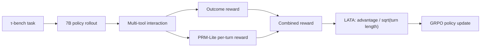
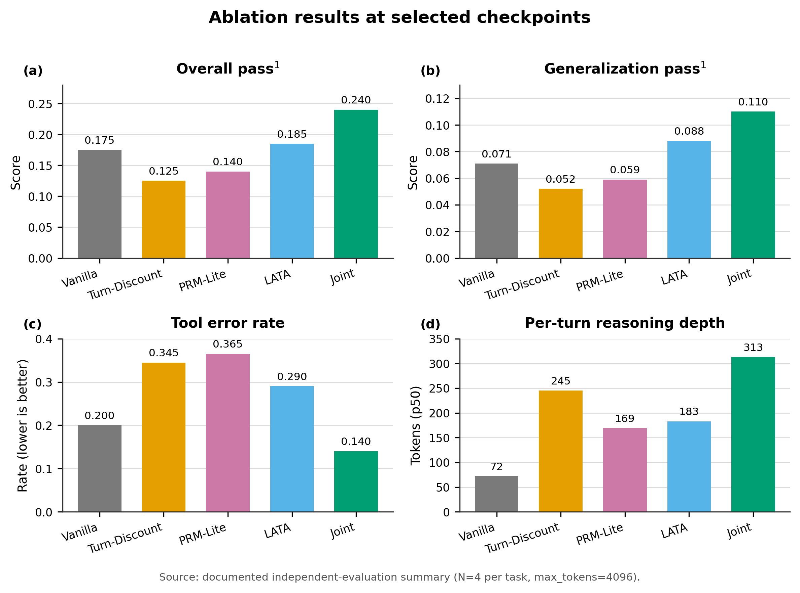
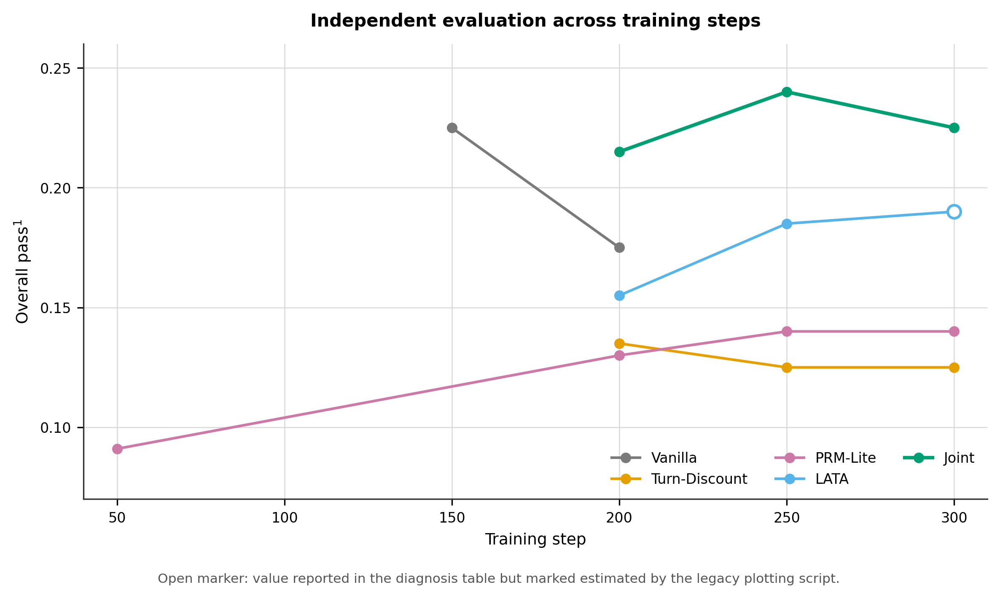

# GRPO Training and Optimization for Long-Chain Multi-Tool Agents

[English](README_EN.md) · [实验文档](docs/README.md) · [技术复盘](docs/retrospective.md) · [训练曲线](https://swanlab.cn/@godstear/agentic-grpo-longhorizon)

[](https://www.python.org/)
[](https://pytorch.org/)
[](https://github.com/volcengine/verl)
[](LICENSE)


面向长链路、多轮、多工具智能体的 GRPO 训练与优化项目。在 τ-bench airline 的系统性消融中，Vanilla GRPO 出现奖励饱和、训练集偏置和逐轮推理退化；本项目通过 **PRM-Lite 过程奖励 + LATA 长度感知优势归一化** 改善局部质量信号的传播。

**最佳报告结果：** step 250 的联合方案取得 `0.240` overall pass^1，相比 Vanilla step 200 的 `0.175` 提升 **37%**；泛化 pass^1 从 `0.071` 提升至 `0.110`，工具错误率从 `0.200` 降至 `0.140`。

> 结果来自项目消融报告中保存的独立评测汇总（每任务 N=4，max_tokens=4096）。

## 项目贡献

- **过程奖励：** 设计 PRM-Lite，由 15 条可解释规则提供连续的逐轮质量信号，并加入占位符、重复调用与 reward hacking 防护。
- **优势估计：** 在 veRL 中实现 Turn-Discount 与 LATA；LATA 使用 `A / √L`，降低长回复中的优势稀释。
- **训练系统：** 打通 τ-bench 交互、vLLM rollout、FSDP 训练、SFT warm start 与独立 pass@k 评测。
- **实验分析：** 以 Vanilla、Turn-Discount、PRM-Lite、LATA 和联合方案构成完整消融，区分训练验证奖励与独立评测。

仓库包含修改后的 [veRL](verl/) 与 [τ-bench](tau-bench/) 源码。个人实现与上游边界详见 [上游修改说明](docs/engineering/upstream-modifications.md)。

## 方法



核心假设是“**信号源 + 信号通路**”必须同时存在：PRM-Lite 提供局部质量信号，LATA 避免该信号被逐轮长度归一化过度稀释。单独使用 PRM-Lite 或 LATA 的收益有限，联合方案才在成功率、泛化和错误率上同时改善。

## 核心结果

| 方案（最佳/基准 checkpoint）          | Overall pass^1 | 泛化 pass^1 | Error rate | Per-turn p50 tokens |
| ----------------------------- | --------------:| ---------:| ----------:| -------------------:|
| Vanilla, step 200             | 0.175          | 0.071     | 0.200      | 72                  |
| Turn-Discount, step 250       | 0.125          | 0.052     | 0.345      | 245                 |
| PRM-Lite, step 250            | 0.140          | 0.059     | 0.365      | 169                 |
| LATA, step 250                | 0.185          | 0.088     | 0.290      | 183                 |
| **PRM-Lite + LATA, step 250** | **0.240**      | **0.110** | **0.140**  | **313**             |

泛化 pass^1 按 `(uncovered_seen × 24 + unseen × 10) / 34` 计算，用于降低训练轨迹覆盖造成的偏置。





完整逐步数据、限制和机制分析见 [消融诊断报告](docs/experiments/ablation/ablation_diagnosis_report.md)。

## 系统与硬件

消融主实验采用两张 A800 80GB：GPU 0 运行 7B policy 的训练/rollout，GPU 1 运行 72B-AWQ 用户模拟器。文档中的三卡拓扑属于 Vanilla 优化实验（Policy TP=2 + 独立模拟器），不是主消融结果的硬件口径。

- Python 3.10，PyTorch 2.7，CUDA 12.x
- veRL 0.6.1，FSDP，vLLM V1，Ray
- Qwen2.5-7B-Instruct policy
- Qwen2.5-72B-Instruct-AWQ user simulator
- τ-bench airline，50 个任务

## 快速开始

### 1. 安装

```bash
git clone <your-repository-url>
cd <repository-directory>
bash setup.sh
conda activate agentrl
```

`setup.sh` 安装根目录的 Python 依赖、vendored veRL 和 τ-bench。模型下载默认关闭；可通过 ModelScope 或 Hugging Face 按配置路径准备 7B policy 与 72B-AWQ simulator。

### 2. 准备训练输入

完整实验依赖未随仓库发布的 SFT 合并模型和 GRPO parquet。相关入口为：

```bash
cd grpo-longchain-multitool-agents
python scripts/train/sft/collect_sft_data.py --help
python scripts/train/grpo/build_grpo_parquet.py --help
```

请先在对应 YAML 中设置本地模型、数据与用户模拟器 API 地址。配置位于 `grpo-longchain-multitool-agents/configs/`。

### 3. 启动训练与评测

```bash
cd grpo-longchain-multitool-agents

# PRM-Lite + LATA
bash scripts/train/grpo/run_exp4_prm_lite_lata.sh

# 独立评测
bash scripts/eval/eval_exp4_prm_lite_lata.sh
```

训练脚本默认面向离线 HPC 环境，可通过环境变量覆盖 `CONDA_ENV`、`CUDA_HOME`、`CUDA_VISIBLE_DEVICES`、`HF_HUB_OFFLINE` 和 `PROJECT_ROOT`。

## 仓库结构

```text
.
├── grpo-longchain-multitool-agents/   # 自研环境、配置、训练/评测脚本
├── docs/                       # 实验报告、工程文档与统一图表
├── tau-bench/                  # vendored benchmark
├── verl/                       # vendored and modified training framework
├── README.md / README_EN.md
├── requirements.txt
└── setup.sh
```

从 [文档索引](docs/README.md) 开始阅读；推荐顺序为 Vanilla 崩溃诊断 → 消融计划 → 消融结果 → 分布式部署。

## 复现边界与局限

- 仓库提供实验结果汇总、绘图数据及复现脚本。
- τ-bench airline 仅 50 个任务，且规则型 PRM 需要领域适配；当前结论不应直接外推到所有工具环境。
- step 250 是联合方案的最佳报告 checkpoint；step 300 回落至 0.225，存在后期过拟合过程奖励的可能。
- 完整训练需要大显存 GPU 和本地模型服务。

## 文档

- [文档总索引](docs/README.md)
- [消融诊断报告](docs/experiments/ablation/ablation_diagnosis_report.md)
- [实验设计手册](docs/experiments/ablation/ablation_plan.md)
- [Vanilla GRPO 崩溃诊断](docs/experiments/vanilla-grpo/vanilla_grpo_diagnosis.md)
- [分布式训练部署](docs/engineering/distributed_training_deployment.md)
- [技术复盘](docs/retrospective.md)

## 许可证与致谢

项目原创部分以 [Apache License 2.0](LICENSE) 发布。`verl/`、`tau-bench/` 以及模型和数据仍遵循各自许可证与使用条款。

感谢 [veRL](https://github.com/volcengine/verl)、[τ-bench](https://github.com/sierra-research/tau-bench) 和 [Qwen](https://github.com/QwenLM/Qwen)。
