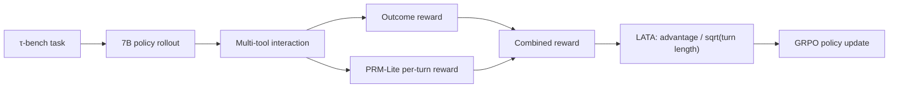

# GRPO Training and Optimization for Long-Chain Multi-Tool Agents

[中文](README.md) · [Documentation](docs/README.md) · [Retrospective](docs/retrospective.md) · [Training curves](https://swanlab.cn/@godstear/agentic-grpo-longhorizon)

[](https://www.python.org/)
[](https://pytorch.org/)
[](https://github.com/volcengine/verl)
[](LICENSE)

The recommended GitHub repository name is `grpo-longchain-multitool-agents`, matching the project source directory. Historical SwanLab runs remain under `agentic-grpo-longhorizon`, so the dashboard URL is unchanged.

GRPO training and optimization for long-horizon, multi-turn, multi-tool agents. A systematic τ-bench airline ablation identifies reward saturation, train-coverage bias, and per-turn reasoning collapse in vanilla GRPO. The proposed **PRM-Lite + LATA** combination improves how local process signals reach policy gradients.

**Best reported result:** the joint method reaches `0.240` overall pass^1 at step 250, a **37%** relative gain over the vanilla step-200 baseline (`0.175`). Generalization pass^1 improves from `0.071` to `0.110`, while tool error rate falls from `0.200` to `0.140`.

> Results are transcribed from the project's independent-evaluation report (N=4 per task, max_tokens=4096). Main-run JSON files and training logs are not published in this repository; see [results_summary.csv](docs/experiments/ablation/results_summary.csv) for the machine-readable transcription and provenance.

## Contributions

- **Process reward:** PRM-Lite uses 15 interpretable rules for dense per-turn signals and includes defenses against placeholders, repeated calls, and reward hacking.
- **Advantage estimation:** Turn-Discount and LATA are implemented in veRL. LATA replaces linear length normalization with `A / √L`.
- **Training system:** τ-bench interaction, vLLM rollout, FSDP training, SFT warm start, and independent pass@k evaluation are integrated end to end.
- **Ablation study:** vanilla, Turn-Discount, PRM-Lite, LATA, and the joint method are evaluated under a common protocol.

The repository vendors modified [veRL](verl/) and [τ-bench](tau-bench/) sources. See [upstream modifications](docs/engineering/upstream-modifications.md) for contribution boundaries.

## Method



The central hypothesis is that a **signal source and a signal pathway** are both necessary. PRM-Lite creates local quality signals; LATA prevents those signals from being over-diluted by per-turn length normalization.

## Results

| Method (selected checkpoint)  | Overall pass^1 | Generalization pass^1 | Error rate | Per-turn p50 tokens |
| ----------------------------- | --------------:| ---------------------:| ----------:| -------------------:|
| Vanilla, step 200             | 0.175          | 0.071                 | 0.200      | 72                  |
| Turn-Discount, step 250       | 0.125          | 0.052                 | 0.345      | 245                 |
| PRM-Lite, step 250            | 0.140          | 0.059                 | 0.365      | 169                 |
| LATA, step 250                | 0.185          | 0.088                 | 0.290      | 183                 |
| **PRM-Lite + LATA, step 250** | **0.240**      | **0.110**             | **0.140**  | **313**             |

Generalization pass^1 is `(uncovered_seen × 24 + unseen × 10) / 34`.


See the [ablation diagnosis report](docs/experiments/ablation/ablation_diagnosis_report.md) for step-level results, limitations, and mechanism analysis.

## System setup

The main ablation uses two A800 80GB GPUs: GPU 0 runs 7B policy training/rollout, and GPU 1 hosts the 72B-AWQ user simulator. The three-GPU topology documented elsewhere is a separate vanilla optimization experiment with policy TP=2.

- Python 3.10, PyTorch 2.7, CUDA 12.x
- veRL 0.6.1, FSDP, vLLM V1, Ray
- Qwen2.5-7B-Instruct policy
- Qwen2.5-72B-Instruct-AWQ user simulator
- τ-bench airline, 50 tasks

## Quick start

```bash
git clone <your-repository-url>
cd <repository-directory>
bash setup.sh
conda activate agentrl

cd grpo-longchain-multitool-agents
bash scripts/train/grpo/run_exp4_prm_lite_lata.sh
bash scripts/eval/eval_exp4_prm_lite_lata.sh
```

The full run requires an SFT-merged model and GRPO parquet that are not distributed here. Set local model/data paths and the simulator API endpoint in `grpo-longchain-multitool-agents/configs/` before training. Launchers are designed for offline HPC use and accept environment overrides such as `CONDA_ENV`, `CUDA_HOME`, `CUDA_VISIBLE_DEVICES`, `HF_HUB_OFFLINE`, and `PROJECT_ROOT`.

## Repository layout

```text
.
├── grpo-longchain-multitool-agents/   # Project source, configs, and launchers
├── docs/                       # Experiment and engineering documentation
├── tau-bench/                  # Vendored benchmark
├── verl/                       # Vendored and modified training framework
├── README.md / README_EN.md
├── requirements.txt
└── setup.sh
```

## Reproducibility boundaries

- This repository provides experimental result summaries, plotting data, and reproduction scripts.
- τ-bench airline contains only 50 tasks, and the rule-based PRM needs domain adaptation.
- The joint method peaks at step 250 and falls to 0.225 at step 300, suggesting possible late process-reward overfitting.
- Full training requires high-memory GPUs and local model services.

## Documentation

- [Documentation index](docs/README.md)
- [Ablation diagnosis](docs/experiments/ablation/ablation_diagnosis_report.md)
- [Ablation design](docs/experiments/ablation/ablation_plan.md)
- [Vanilla GRPO diagnosis](docs/experiments/vanilla-grpo/vanilla_grpo_diagnosis.md)
- [Distributed training deployment](docs/engineering/distributed_training_deployment.md)
- [Technical retrospective](docs/retrospective.md)

## License and acknowledgements

Original project code is released under the [Apache License 2.0](LICENSE). The vendored veRL and τ-bench components, models, and data remain subject to their respective licenses and terms.

Thanks to [veRL](https://github.com/volcengine/verl), [τ-bench](https://github.com/sierra-research/tau-bench), and [Qwen](https://github.com/QwenLM/Qwen).
