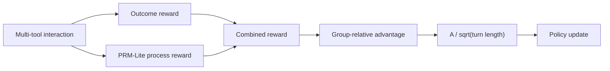

# GRPO Training and Optimization for Long-Chain Multi-Tool Agents

> 从训练崩溃到稳定改进：PRM-Lite + LATA 的长链路 Agent GRPO 实践

## 摘要

将 GRPO（Group Relative Policy Optimization）直接用于长链路、多工具对话智能体时，训练并不稳定。本项目以 τ-bench airline 的 50 个任务为实验场景，定位了三个相互关联的问题：群组奖励饱和、训练轨迹覆盖造成的评测偏置，以及逐轮推理中的长度归一化副作用。

四组消融最终指向一个组合：**PRM-Lite 提供可解释的局部过程信号，LATA 用平方根长度归一化改善该信号向 token 梯度的传播。** 报告中的最佳 checkpoint 在 overall pass^1 上由 Vanilla 的 0.175 提升至 0.240，同时将工具错误率从 0.200 降至 0.140。

本文复盘问题、失败实验、联合方案和工程部署。机器可读结果与绘图脚本分别位于 [`results_summary.csv`](experiments/ablation/results_summary.csv) 和 [`plot_ablation_figures.py`](../grpo-longchain-multitool-agents/scripts/plotting/plot_ablation_figures.py)。

## 1. 为什么长链路多工具训练更难

τ-bench airline 要求智能体在多轮对话中查询航班、预订、改签和修改行李。一次轨迹通常包含多次用户回复、策略推理和工具调用；前面一轮的错误会改变后续可观察状态。

在这一环境中，Vanilla GRPO 呈现出三个失效模式。

### 1.1 群组奖励饱和

任务结果奖励是二元的。`group_size=8` 时，一组轨迹可能全部失败或全部成功，组内方差接近零，优势信号随之消失。策略开始退化后，全 0 组变多，进一步削弱恢复所需的梯度。

### 1.2 训练轨迹覆盖偏置

40 个训练任务中，部分任务存在 72B 教师轨迹覆盖。策略可能记忆 covered_seen 的模式，而没有获得可迁移的工具使用能力。因此训练验证奖励会高估真实性能。本项目使用

```text
generalization pass^1 =
    (uncovered_seen × 24 + unseen × 10) / 34
```

作为补充指标，并始终保留独立评测结果。

### 1.3 逐轮推理退化

线性长度归一化 `A / L` 会随回复变长快速稀释每个 token 的优势。策略由此偏好短回复和频繁工具试错，而不是保留必要的推理。Vanilla 在后期从峰值回落，step 200 被选作崩溃后的消融基线。

## 2. 四组消融：失败同样重要

### 2.1 Turn-Discount：保护而非引导

Turn-Discount 用指数权重提高早期 token 的优势权重。它缓解了回复长度的断崖，但 step 250 的 overall pass^1 只有 0.125。这个结果说明：保护已有行为并不等于提供正确的质量方向。

### 2.2 LATA：降低长推理的梯度惩罚

LATA（Length-Aware Turn Advantage）将线性归一化替换为

```text
advantage_token = A / sqrt(L)
```

当长度扩大 4 倍时，每 token 信号只缩小到 1/2，而不是 1/4。LATA 在 step 250 达到 0.185，优于崩溃后的 Vanilla，但没有局部质量信号时仍有明显上限。

### 2.3 PRM-Lite：有信号源，但传播不足

PRM-Lite 使用 15 条规则提供 `[-0.5, +0.5]` 的过程分数：

- 惩罚占位符、冗余调用、重复错误和无推理操作；
- 奖励错误恢复、数据链完整性、读取多样性和条件化思考；
- 通过 schema 实体提取与条件触发减少 reward hacking。

它打破了纯二元结果奖励的饱和，但单独使用时 overall 只有 0.140，错误率升至 0.365。问题不是缺少信号，而是局部信号经过线性长度归一化后仍被稀释。

### 2.4 联合方案：信号源 + 信号通路

联合方案把 PRM-Lite 的过程信号与 LATA 的平方根归一化放在同一训练链路中：



PRM-Lite 是信号源，LATA 是信号通路。两者的互补性比任一组件的单独结果更重要。

## 3. 结果


联合方案 step 250 的主要指标为：

- overall pass^1：0.240，相比 Vanilla step 200 的 0.175 提升 37%；
- generalization pass^1：0.110，相比 0.071 提升 55%；
- error rate：0.140，相比 0.200 降低 30%；
- per-turn p50：313 tokens。


联合方案在 step 250 达到峰值，step 300 回落至 0.225；这提示后期可能出现对过程奖励模式的过拟合。LATA step 300 的 0.190 在旧绘图脚本中标记为估计值，新图用空心点明确区分。

## 4. 工程部署：两卡主实验与三卡优化不要混用

主消融实验采用两张 A800 80GB：

- GPU 0：7B policy，FSDP Actor/Ref 与 vLLM rollout 通过 sleep/wake 和 offload 时分复用；
- GPU 1：72B-AWQ 用户模拟器，作为独立 vLLM OpenAI 服务。

Vanilla 的另一条优化路径启用了 policy rollout TP=2，因此需要两张策略卡和第三张用户模拟器卡。它不是主消融结果的硬件口径。

显存优化主要来自：

- bypass 复用 rollout log probabilities，减少不必要的重算；
- fused kernels 降低大词表 logits 的中间内存；
- FSDP 参数/优化器 offload 与 vLLM cache sleep；
- LoRA 下通过关闭 adapter 计算 Ref，而不是常驻另一份完整 7B。

详细流程见 [分布式训练部署文档](engineering/distributed_training_deployment.md)。

## 5. 局限

1. τ-bench airline 只有 50 个任务，小样本方差不可忽略。
2. PRM-Lite 是领域相关的手工规则，迁移到 retail 或其他工具环境需要重新适配。
3. 主实验 checkpoint、完整 eval JSON 和训练日志未随仓库发布；仓库图表是对诊断报告汇总值的可复现转录，不是重新执行评测所得。
4. LATA step 300 的点在旧脚本中标为估计值，不能与其余已报告点同等解读。
5. 当前实验仅覆盖 7B policy，结论尚未在更大模型规模上验证。

## 6. 结语

这组实验最有价值的不是单个技巧，而是失败路径给出的分解：长链路 GRPO 既需要更密集的局部质量信号，也需要避免这些信号在长回复中被过度归一化。PRM-Lite 与 LATA 分别解决两个问题，联合后才形成完整链路。

完整实验设计与逐 checkpoint 数据见：

- [消融实验设计](experiments/ablation/ablation_plan.md)
- [消融诊断报告](experiments/ablation/ablation_diagnosis_report.md)
- [文档总索引](README.md)
